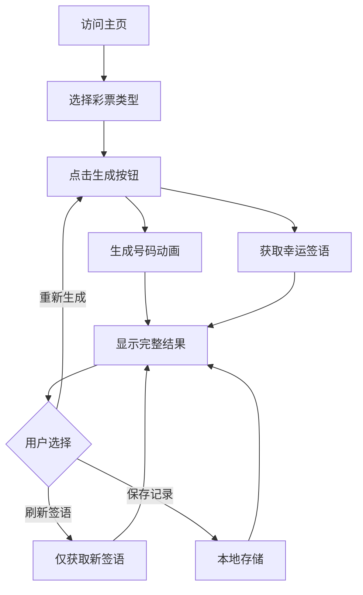

# Fortune Cookie API 集成产品需求文档

## 1. 产品概述

本项目旨在将 Fortune Cookie API 集成到现有的中国福利彩票号码随机生成器中，为用户在生成彩票号码的同时提供幸运签语和中文格言，增强产品的趣味性和文化内涵。

- 在保持现有核心功能的基础上，增加幸运签语展示功能
- 为彩票号码生成过程增添更多的仪式感和期待感
- 通过中华传统文化元素提升用户体验和产品价值

## 2. 核心功能

### 2.1 用户角色
本产品无需用户注册，所有功能对访客开放。

### 2.2 功能模块

我们的彩票号码生成器增强版包含以下主要页面：
1. **主页面**：彩票类型选择、号码生成区域、幸运签语展示区域
2. **关于页面**：产品介绍和使用说明

### 2.3 页面详情

| 页面名称 | 模块名称 | 功能描述 |
|---------|---------|---------|
| 主页面 | 彩票类型选择器 | 支持双色球、七乐彩、福彩3D、快乐8四种彩票类型选择 |
| 主页面 | 号码生成区域 | 显示生成的彩票号码，保持现有的翻页动画效果 |
| 主页面 | 幸运签语展示区域 | 显示从Fortune Cookie API获取的幸运签语和中文格言 |
| 主页面 | 生成控制按钮 | 生成新号码、刷新签语、保存记录等操作 |
| 关于页面 | 产品介绍 | 说明产品功能和使用方法 |
| 关于页面 | API说明 | 介绍Fortune Cookie API的来源和作用 |

## 3. 核心流程

**用户操作流程：**
1. 用户访问主页面
2. 选择彩票类型（双色球/七乐彩/福彩3D/快乐8）
3. 点击"生成幸运号码"按钮
4. 系统同时生成彩票号码和获取幸运签语
5. 展示号码动画效果和签语内容
6. 用户可选择重新生成或刷新签语

## 4. 用户界面设计

### 4.1 设计风格
- **主色调**：保持现有的红色(#dc2626)和蓝色(#2563eb)主题
- **辅助色彩**：金色(#f59e0b)用于签语区域，营造吉祥氛围
- **按钮风格**：圆角设计，保持现有3D效果
- **字体**：继续使用Geist字体系列，签语区域使用更优雅的字体展示
- **布局风格**：卡片式布局，响应式设计
- **图标风格**：使用Lucide React图标库，简洁现代

### 4.2 页面设计概览

| 页面名称 | 模块名称 | UI元素 |
|---------|---------|--------|
| 主页面 | 标题区域 | 渐变背景，大标题"好运来敲我的门"，副标题增加"幸运签语助力" |
| 主页面 | 彩票选择器 | 保持现有下拉选择器样式，增加选择提示 |
| 主页面 | 号码展示区 | 保持现有翻页动画，红蓝配色方案 |
| 主页面 | 签语展示区 | 金色边框卡片，毛笔字效果，中英文对照显示 |
| 主页面 | 操作按钮组 | 主按钮"生成幸运号码"，次要按钮"刷新签语" |

### 4.3 响应式设计
- **桌面优先**：主要针对桌面端设计，1200px以上最佳体验
- **移动适配**：768px以下自动调整为单列布局
- **触摸优化**：按钮区域增大，适合移动端操作

## 5. 技术集成要求

### 5.1 API集成
- 集成Fortune Cookie API的四个端点：/v1/fortunes、/v1/lessons、/v1/lottos、/v1/cookie
- 通过Next.js API Routes作为代理，解决CORS问题
- 实现错误处理和降级方案

### 5.2 性能优化
- 实现API响应缓存机制
- 签语内容本地存储，减少重复请求
- 保持现有号码生成的流畅动画效果

### 5.3 用户体验
- 签语加载时显示优雅的loading状态
- API失败时显示预设的备用签语
- 保持现有的本地存储功能