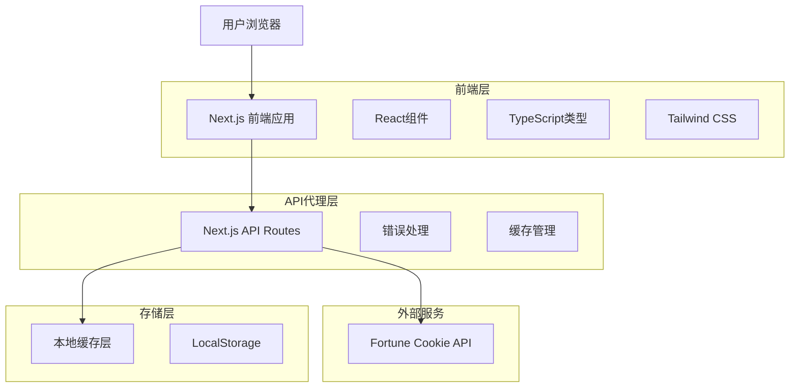
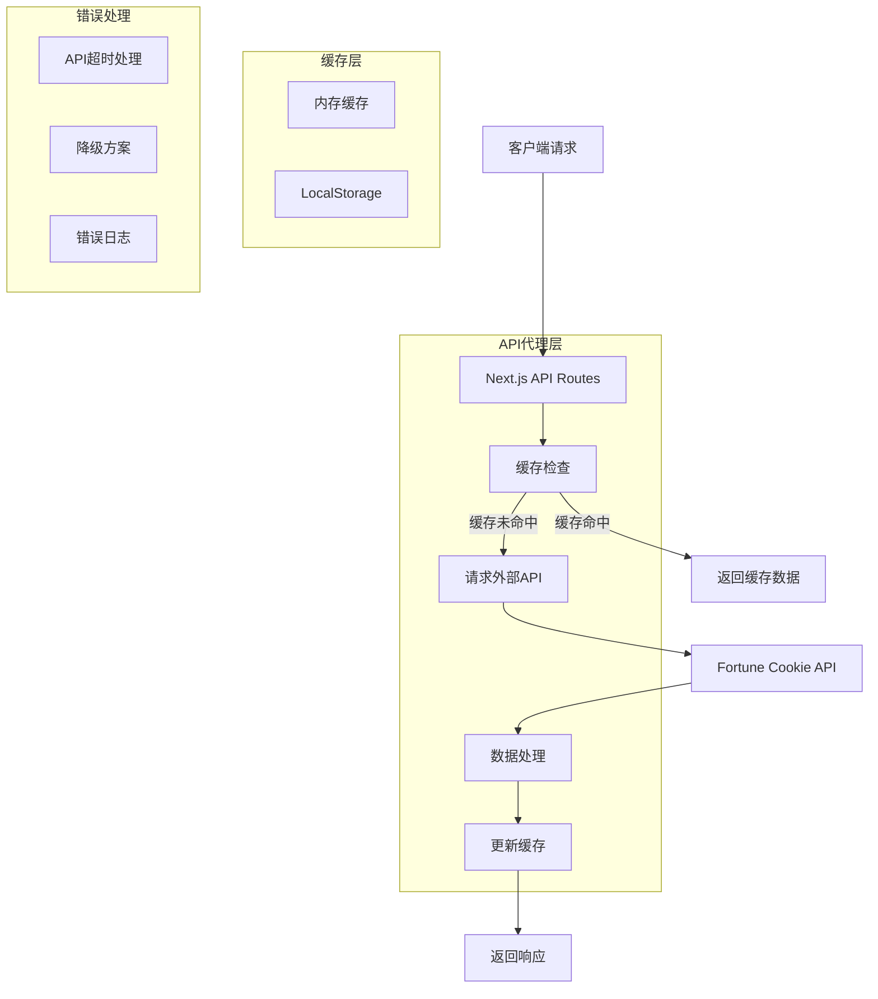
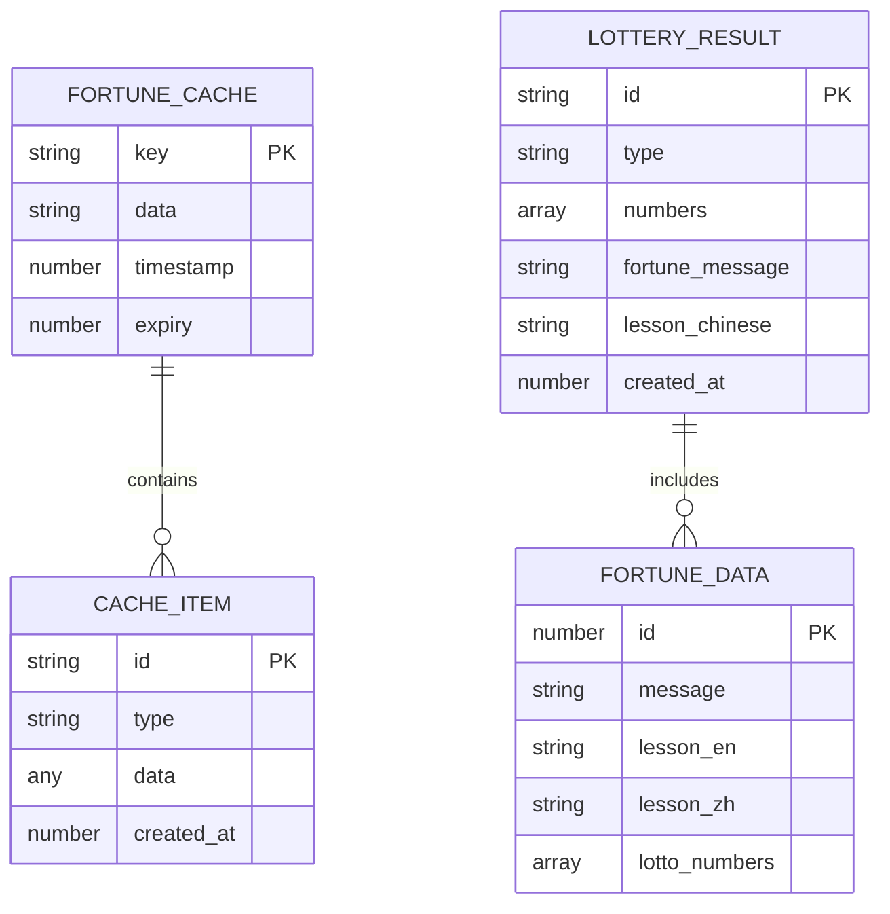

# Fortune Cookie API 集成技术架构文档

## 1. 架构设计



## 2. 技术描述

- **前端**: React@19 + Next.js@16 + TypeScript@5 + Tailwind CSS@4
- **UI组件**: Shadcn/UI + Lucide React图标
- **状态管理**: React Hooks (useState, useEffect, useMemo)
- **API代理**: Next.js API Routes
- **缓存**: 浏览器LocalStorage + 内存缓存
- **外部API**: Fortune Cookie API (fortunecookieapi.herokuapp.com)

## 3. 路由定义

| 路由 | 用途 |
|------|-----|
| / | 主页面，彩票号码生成和幸运签语展示 |
| /about | 关于页面，产品介绍和API说明 |
| /api/fortune | API代理端点，获取幸运签语 |
| /api/fortune/cookie | API代理端点，获取完整fortune cookie数据 |

## 4. API定义

### 4.1 核心API

**获取幸运签语**
```
GET /api/fortune
```

Response:
| 参数名称 | 参数类型 | 描述 |
|---------|---------|------|
| success | boolean | 请求是否成功 |
| data | FortuneData | 签语数据 |
| error | string | 错误信息（可选） |

**获取完整Fortune Cookie数据**
```
GET /api/fortune/cookie
```

Response:
| 参数名称 | 参数类型 | 描述 |
|---------|---------|------|
| success | boolean | 请求是否成功 |
| data | CookieData | 完整cookie数据 |
| error | string | 错误信息（可选） |

### 4.2 TypeScript类型定义

```typescript
// Fortune Cookie API 响应类型
interface FortuneData {
  fortune: string;
  lesson: string;
  lotto: number[];
}

interface CookieData {
  fortune: {
    message: string;
    id: number;
  };
  lesson: {
    english: string;
    chinese: string;
    id: number;
  };
  lotto: {
    id: number;
    numbers: number[];
  };
}

// API响应包装类型
interface ApiResponse<T> {
  success: boolean;
  data?: T;
  error?: string;
  cached?: boolean;
  timestamp?: number;
}

// 缓存管理类型
interface CacheItem<T> {
  data: T;
  timestamp: number;
  expiry: number;
}
```

## 5. 服务器架构图



## 6. 数据模型

### 6.1 数据模型定义



### 6.2 数据存储方案

**LocalStorage结构**
```typescript
// 缓存键名规范
const CACHE_KEYS = {
  FORTUNE: 'lottery-consulter:fortune-cache',
  LESSON: 'lottery-consulter:lesson-cache',
  LOTTO: 'lottery-consulter:lotto-cache',
  LAST_RESULT: 'lottery-consulter:last-result'
} as const;

// 缓存数据结构
interface StorageData {
  fortunes: CacheItem<FortuneData>[];
  lessons: CacheItem<LessonData>[];
  lastResult: {
    lottery: GeneratedResult;
    fortune: FortuneData;
    timestamp: number;
  };
}
```

**缓存策略**
- Fortune签语：缓存30分钟
- Lesson格言：缓存1小时  
- Lotto号码：缓存15分钟
- 用户最后结果：永久存储直到用户清除

**错误处理和降级方案**
```typescript
// 备用签语数据
const FALLBACK_FORTUNES = [
  "好运即将降临，保持积极心态",
  "机会总是留给有准备的人",
  "今日宜投注，财运亨通",
  // ... 更多备用签语
];

// 错误处理流程
const handleApiError = (error: Error) => {
  console.error('Fortune API Error:', error);
  return {
    success: true,
    data: {
      fortune: getRandomFallbackFortune(),
      lesson: getRandomFallbackLesson(),
      lotto: generateRandomLotto()
    },
    cached: false,
    fallback: true
  };
};
```

## 7. 性能优化策略

### 7.1 缓存机制
- **多层缓存**：内存缓存 + LocalStorage + API响应缓存
- **智能过期**：根据数据类型设置不同的缓存时间
- **预加载**：页面加载时预先获取签语数据

### 7.2 请求优化
- **并发请求**：号码生成和签语获取并行执行
- **请求去重**：防止短时间内重复请求
- **超时控制**：设置合理的API请求超时时间

### 7.3 用户体验优化
- **渐进式加载**：先显示号码，再显示签语
- **优雅降级**：API失败时使用本地备用数据
- **加载状态**：提供清晰的加载反馈