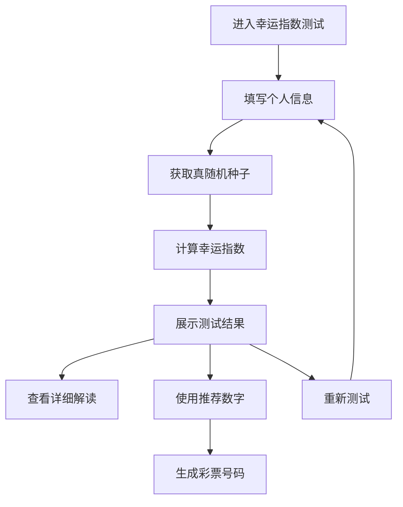

# 幸运指数测试功能 - 产品需求文档

## 1. 产品概述

幸运指数测试是一个结合真随机数生成技术和个性化算法的互动功能，为用户提供基于个人信息的幸运指数评估和个性化幸运数字推荐。该功能将Random.org API的真随机性与用户的个人特征相结合，创造独特的幸运体验。

- 通过科学的真随机数生成技术，提升用户对结果的信任度和参与感
- 结合个人信息创造个性化体验，增强用户粘性和回访率
- 为现有彩票咨询功能提供更丰富的互动元素和娱乐价值

## 2. 核心功能

### 2.1 用户角色
本功能面向所有网站访客，无需注册即可使用，保护用户隐私的同时提供完整体验。

### 2.2 功能模块

幸运指数测试功能包含以下核心页面和模块：

1. **幸运指数测试页面**：用户信息输入、指数计算、结果展示
2. **个性化设置模块**：个人信息收集、偏好设置
3. **幸运解读模块**：指数解释、幸运建议、数字推荐

### 2.3 页面详情

| 页面名称 | 模块名称 | 功能描述 |
|---------|---------|---------|
| 幸运指数测试页面 | 个人信息输入区 | 收集用户姓名、生日、幸运颜色等基本信息，支持可选填写保护隐私 |
| 幸运指数测试页面 | 真随机数生成区 | 调用Random.org API生成真随机种子，展示生成过程增加透明度 |
| 幸运指数测试页面 | 幸运指数计算区 | 基于个人信息和随机种子计算幸运指数，显示计算进度和动画效果 |
| 幸运指数测试页面 | 结果展示区 | 显示幸运指数评分、个性化幸运数字、详细解读和建议 |
| 幸运指数测试页面 | 互动功能区 | 重新测试按钮、分享功能、与彩票号码生成的联动 |

## 3. 核心流程

### 用户操作流程：

1. **信息输入阶段**：用户进入幸运指数测试页面，填写个人信息（姓名、生日、幸运颜色等）
2. **随机数生成阶段**：系统调用Random.org API获取真随机种子，向用户展示生成过程
3. **指数计算阶段**：结合个人信息和随机种子，通过算法计算个性化幸运指数
4. **结果展示阶段**：显示幸运指数评分、推荐幸运数字、详细解读和建议
5. **互动延伸阶段**：用户可重新测试、分享结果或使用推荐数字生成彩票号码

## 4. 用户界面设计

### 4.1 设计风格
- **主色调**：保持现有金色主题（#FFD700, #FFA500），体现幸运和财富寓意
- **辅助色彩**：深蓝色（#1E3A8A）作为背景，白色（#FFFFFF）用于内容区域
- **按钮风格**：圆角渐变按钮，悬停时有光泽效果
- **字体**：中文使用思源黑体，英文使用Inter，标题18px，正文16px
- **布局风格**：卡片式设计，居中布局，响应式适配
- **动画效果**：使用渐变动画和数字滚动效果增强视觉体验

### 4.2 页面设计概览

| 页面名称 | 模块名称 | UI元素 |
|---------|---------|--------|
| 幸运指数测试页面 | 个人信息输入区 | 表单卡片，包含姓名输入框、日期选择器、颜色选择器，金色边框，圆角设计 |
| 幸运指数测试页面 | 真随机数生成区 | 进度条显示API调用状态，随机数实时展示，带有"真随机"标识和说明 |
| 幸运指数测试页面 | 幸运指数计算区 | 圆形进度环显示计算进度，数字动画效果，金色渐变背景 |
| 幸运指数测试页面 | 结果展示区 | 大号幸运指数评分，星级显示，推荐数字网格布局，解读文本卡片 |
| 幸运指数测试页面 | 互动功能区 | 重新测试按钮、分享按钮、"用此数字试手气"按钮，统一金色主题 |

### 4.3 响应式设计
- **桌面端优先**：主要针对桌面浏览器优化，支持鼠标悬停效果
- **移动端适配**：在移动设备上自动调整布局，触摸友好的按钮尺寸
- **触摸优化**：所有交互元素支持触摸操作，适当增大点击区域