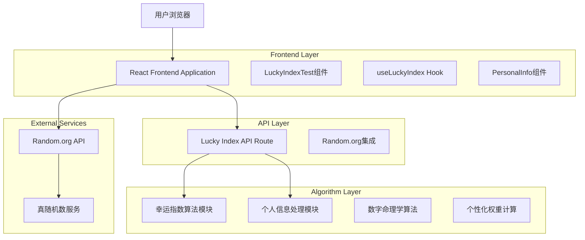
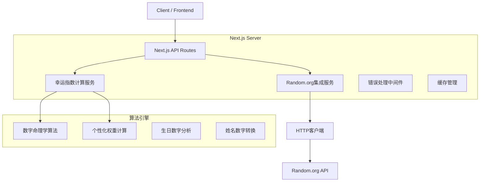
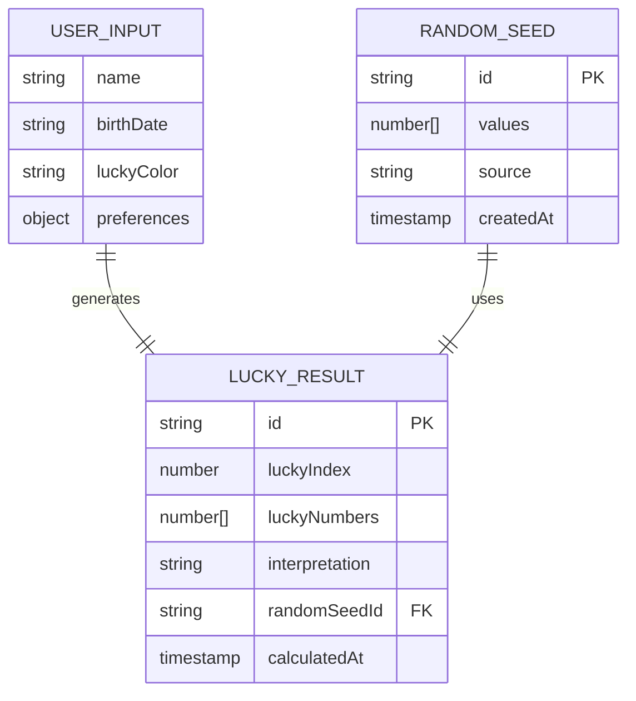

# 幸运指数测试功能 - 技术架构文档

## 1. 架构设计



## 2. 技术描述

* **Frontend**: React\@18 + TypeScript + Tailwind CSS + Next.js\@14

* **API Integration**: Random.org HTTP API + 自定义算法引擎

* **状态管理**: React Hooks (useState, useEffect, useCallback)

* **UI组件**: 自定义组件 + Tailwind CSS动画

* **数据处理**: 客户端算法计算 + API数据融合

## 3. 路由定义

| 路由               | 用途                                |
| ---------------- | --------------------------------- |
| /lucky-test      | 幸运指数测试主页面，包含所有测试功能和结果展示           |
| /api/lucky-index | 后端API路由，处理幸运指数计算和Random.org API集成 |
| /api/random-seed | Random.org API代理路由，获取真随机种子数据      |

## 4. API定义

### 4.1 核心API

**幸运指数计算API**

```
POST /api/lucky-index
```

Request:

| 参数名称        | 参数类型   | 是否必需  | 描述                 |
| ----------- | ------ | ----- | ------------------ |
| name        | string | true  | 用户姓名，用于数字命理学计算     |
| birthDate   | string | true  | 出生日期，格式：YYYY-MM-DD |
| luckyColor  | string | false | 幸运颜色，影响权重计算        |
| preferences | object | false | 其他偏好设置             |

Response:

| 参数名称           | 参数类型      | 描述             |
| -------------- | --------- | -------------- |
| luckyIndex     | number    | 幸运指数评分 (0-100) |
| luckyNumbers   | number\[] | 推荐的幸运数字数组      |
| interpretation | string    | 幸运指数解读文本       |
| randomSeed     | string    | 使用的随机种子值       |
| timestamp      | string    | 计算时间戳          |

Example Request:

```json
{
  "name": "张三",
  "birthDate": "1990-05-15",
  "luckyColor": "red",
  "preferences": {
    "numberRange": "1-49",
    "count": 6
  }
}
```

Example Response:

```json
{
  "luckyIndex": 87,
  "luckyNumbers": [7, 15, 23, 31, 42, 49],
  "interpretation": "您的幸运指数非常高！今天是展现才华的好日子...",
  "randomSeed": "1234567890abcdef",
  "timestamp": "2024-01-15T10:30:00Z"
}
```

**Random.org代理API**

```
GET /api/random-seed
```

Request:

| 参数名称  | 参数类型   | 是否必需  | 描述             |
| ----- | ------ | ----- | -------------- |
| count | number | false | 需要的随机数数量，默认为1  |
| min   | number | false | 最小值，默认为1       |
| max   | number | false | 最大值，默认为1000000 |

Response:

| 参数名称    | 参数类型      | 描述     |
| ------- | --------- | ------ |
| success | boolean   | 请求是否成功 |
| data    | number\[] | 随机数数组  |
| source  | string    | 数据来源标识 |

## 5. 服务器架构图



## 6. 数据模型

### 6.1 数据模型定义



### 6.2 TypeScript类型定义

**用户输入类型**

```typescript
interface UserInput {
  name: string;
  birthDate: string; // YYYY-MM-DD format
  luckyColor?: string;
  preferences?: {
    numberRange?: string;
    count?: number;
    includeZero?: boolean;
  };
}
```

**随机种子类型**

```typescript
interface RandomSeed {
  id: string;
  values: number[];
  source: 'random.org' | 'fallback';
  createdAt: string;
  isAuthentic: boolean;
}
```

**幸运结果类型**

```typescript
interface LuckyResult {
  luckyIndex: number; // 0-100
  luckyNumbers: number[];
  interpretation: string;
  randomSeed: string;
  timestamp: string;
  confidence: number; // 结果可信度
  factors: {
    nameScore: number;
    birthScore: number;
    colorScore: number;
    randomScore: number;
  };
}
```

**API响应类型**

```typescript
interface LuckyIndexResponse {
  success: boolean;
  data?: LuckyResult;
  error?: string;
  metadata: {
    processingTime: number;
    apiVersion: string;
    randomSource: string;
  };
}
```

### 6.3 算法配置

**数字命理学权重配置**

```typescript
const NUMEROLOGY_WEIGHTS = {
  name: 0.3,        // 姓名数字权重
  birthDate: 0.4,   // 生日数字权重
  luckyColor: 0.1,  // 幸运颜色权重
  randomSeed: 0.2   // 随机种子权重
};

const COLOR_VALUES = {
  red: 1,
  orange: 2,
  yellow: 3,
  green: 4,
  blue: 5,
  purple: 6,
  pink: 7,
  white: 8,
  black: 9
};
```

### 6.4 缓存策略

* **Random.org API结果**: 缓存5分钟，避免频繁调用外部API

* **用户计算结果**: 不缓存，确保每次测试的独特性

* **算法配置**: 应用启动时加载，运行期间不变

* **错误回退数据**: 缓存24小时，在外部API不可用时使用

